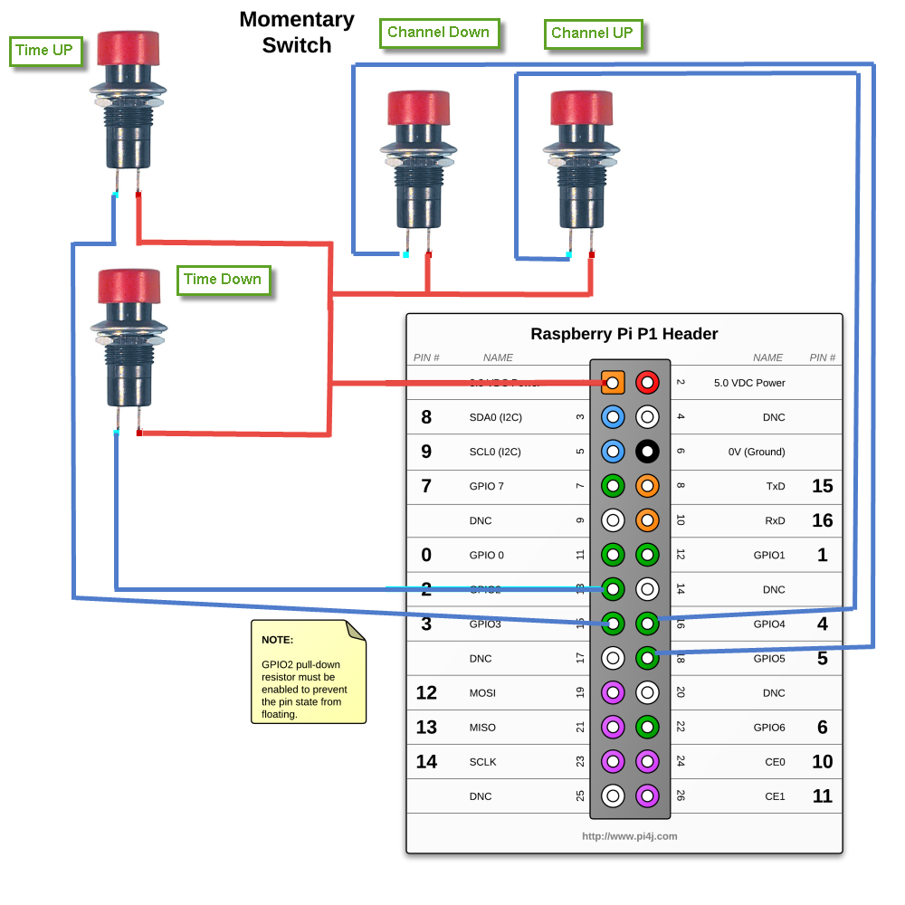

# TVProgram
[](https://travis-ci.org/cedricwalter/TVProgram)

## Introduction

For People with visual impairments it is difficult or impossible to use on-screen TV programme guides, though watching TV remains important to them.

Click below to see video on youtube

[](https://youtu.be/bEzWkPFL3ns)

This java application is able to get the TV program and read with a Text to Speech (TTS) engine on any computer: Windows, Linux, MAC and event platform like the Raspberry PI. 

This is especially useful for blind or disabled people. It run very well on a raspberry pi and can be used with physical buttons, crontab, command line.


It use either Amazon AWS Polly or MaryTTS:
* Amazon AWS Polly Amazon Polly is a service that turns text into lifelike speech. Polly lets you create applications that talk, enabling you to build entirely new categories of speech-enabled products. Polly is an Amazon AI service that uses advanced deep learning technologies to synthesize speech that sounds like a human voice. https://aws.amazon.com/polly/
* MaryTTS (https://github.com/marytts/marytts), an open-source, multilingual Text-to-Speech Synthesis platform written in Java. It was originally developed as a collaborative project of DFKI’s Language Technology Lab and the Institute of Phonetics at Saarland University. It is now maintained by the Multimodal Speech Processing Group in the Cluster of Excellence MMCI and DFKI.
As of version 5.2, MaryTTS supports German, British and American English, French, Italian, Luxembourgish, Russian, Swedish, Telugu, and Turkish; more languages are in preparation. MaryTTS comes with toolkits for quickly adding support for new languages and for building unit selection and HMM-based synthesis voices.

## Currently
* TVProgram support fetching any RSS feed, a plugin for the french TV program (https://webnext.fr/programme-tv-rss) is provided, adding yours is easy: just `implements TVProgramBuilder`
* RSS is cached for more efficiency
* Up to 3 different TVGuide: what on TV now?, what's on TV tonight? and an interactive guide whcih let you navigate on time axis and across channels. 
* and then read by either MaryTTS http://mary.dfki.de/ or Amazon AWS Polly
* Time like 13:15 can be converted in English to "Quarter past One" or "treize heure et quart"
* Support hardware keyboard,

## Configuration

You need to configure the TV program source `TVProgramBuilder`, a text to sound engine `TTSReader` in config.properties.
The TVGuide type is selected with command line or by using Button on Raspberry PI.

* `config.properties` is either located in classpath or in current directory, an example is located in `src/etc/config.properties`
* Free and Premium channel can be filtered out in `config.properties`
* Sentences are templates driven (http://freemarker.org/) for easy customization and translation to something else than French.

# TVProgramBuilder

Provider of TVProgram RSS feed. Only one provider is supported plugin can be written to support any Providers.

`TVProgramBuilder=com.waltercedric.tvprogram.plugins.sources.Webnext`

# TTSReader sound engine

TVprogram support many TTS engine, choose one by setting the key `TTSReader` in `config.properties`

### MaryTTSReader
Mary TTS: Quite demanding on resources, run offline, even on a PI3 do not run so great.

* Voices can be configured, for french "upmc-pierre-hsmm" or "enst-camille-hsmm" is recommended

#### config.properties
Set at least the following
```
TVReader=com.waltercedric.tvprogram.plugins.reader.MaryTTSReader
voice=upmc-pierre-hsmm
```

### PollyTTSReader
Amazon AWS Polly: Sound great but send data to cloud, 42 languages supported:
English American, French, Portuguese, Brazilian, English Australian, French Canadian, Romanian
English British, German, Russian, English Indian, Icelandic, Spanish, Castilian, English Welsh, Italian	Spanish, American
Welsh, Japanese, Swedish, Danish, Polish, Turkish, Dutch, Portuguese, Norwegian

#### Pricing and Availability
You can use Polly to process 5 million characters per month at no charge. After that, you pay $0.000004 per character, 
or about $0.004 per minute of generated audio. That works out to about $2.40 for the full text of Adventures of Huckleberry Finn.

Polly is available now in the US East (Northern Virginia), US West (Oregon), US East (Ohio), and EU (Ireland) Regions

#### config.properties
Set at least the following
```
TVReader=com.waltercedric.tvprogram.plugins.reader.PollyTTSReader
TVReader.PollyTTSReader.IAM-access=xxxxx
TVReader.PollyTTSReader.IAM-secret=xxxxx
TVReader.PollyTTSReader.region=us-east-1
TVReader.PollyTTSReader.voiceid=Mathieu
```

see also https://aws.amazon.com/polly/faqs/

### NoOPTTSReader
Do not read aloud text but log sentences to system out.

# Different TV Guide

TVprogram support many TV Guide implementations.

## Interactive guide
You can navigate through the TV Program with 4 buttons: time up/down and channel up/down

There is currently 3 runner available, key `InteractiveTVGuide.runner`:

* `com.waltercedric.tvprogram.pi.runner.CommandLineRunner`    respond to key on keyboard:  time +/- / channel d/f 
* `com.waltercedric.tvprogram.pi.runner.CustomPiRunner`       run on pi, with your own pin mapping
* `com.waltercedric.tvprogram.pi.runner.JoyItKeyboardPiRunner`  support JOY-IT keyboard for PI


You can define your own GPIO mapping to function for CustomPiRunner:
```
CustomPiRunner.gpio.channel.up=GPIO 2
CustomPiRunner.gpio.channel.down=GPIO 3
CustomPiRunner.gpio.time.up=GPIO 4
CustomPiRunner.gpio.time.down=GPIO 5
 ```
 
You can define your own GPIO mapping to function for JoyItKeyboardPiRunner:
```
JoyItKeyboardPiRunner.channel.up=1
JoyItKeyboardPiRunner.channel.down=2
JoyItKeyboardPiRunner.time.up=3
JoyItKeyboardPiRunner.time.down=4
```
 
It start reading first channel at current time, press time up or down for 30 min increment, navigate channel list with 2 another push button
Any push on one of these button move to next time slot or channel.

Time increment can be changed
`InteractiveTVGuide.time.increment=30`


Recommended to run on a pi with 4 digital buttons

`java -jar tvprogram-1.0-SNAPSHOT-shaded.jar interactive`

The natural order in config.properties for channel is taken, in a circular fashion
free=channel1,channel2,channel3
if you press more than 3 times on channel up button, you will start again on channel1

Pin names can be assigned (mapping) in config.properties

## Get tv program running now
Give you the actual TVProgram on all channels running now.

`java -jar tvprogram-1.0-SNAPSHOT-shaded.jar now`

**Example when TTSReader=NoOPTTSReader**
```
A la télévision en ce moment,
Sur TF1, Egarement coupable, reste 12 minutes sur 100 minutes
Sur France 2, Mille et une vies, reste 22 minutes sur 105 minutes
Sur France 3, Rex, reste 7 minutes sur 45 minutes
Sur France 5, Echo-logis, reste 22 minutes sur 30 minutes
Sur M6, La boutique des secrets, reste 27 minutes sur 120 minutes
Sur Arte, We Want Sex Equality, reste 27 minutes sur 130 minutes
Sur C8, Maigret, reste 137 minutes sur 140 minutes
Sur W9, Une nounou d'enfer, reste 22 minutes sur 30 minutes
Sur TMC, Columbo, reste 17 minutes sur 85 minutes
Sur NT1, Gossip Girl, reste 17 minutes sur 50 minutes
Sur NRJ 12, Tellement vrai, reste 7 minutes sur 110 minutes
Sur France 4, Par amour, reste 7 minutes sur 25 minutes
Sur Gulli, Objectif Blake !, reste 6 minutes sur 11 minutes
Sur RTL 9, Double visage, reste 7 minutes sur 95 minutes
Sur HD1, New York, section criminelle, reste 32 minutes sur 55 minutes
Sur 6ter, Docteur Quinn, femme médecin, reste 27 minutes sur 55 minutes
```

## Get tv program starting between 20:00 and 22:00
Configurable guide, for example all TVProgram tonight on all channels

`java -jar tvprogram-1.0-SNAPSHOT-shaded.jar program "20:00" "22:00"`

**Example when TTSReader=NoOPTTSReader**
```
Sur TF1, de 20:45 à 20:50, durée 5 minutes, Nos chers voisins Série humoristique > Stephan Kopecky > Martin Lamotte (Jean-Pierre Lambert) > Gil Alma (Alain Stuck) > Christelle Reboul (Amélie Dubernet-Carton) Problèmes de famille ou d'éducation, justice, religion, politique : la vie des voisins rebondit sur les sujets de société de manière drôle, cocasse ou touchante.
Sur TF1, de 20:50 à 20:55, durée 5 minutes, C'est Canteloup Divertissement-humour > Nikos Aliagas > Nicolas Canteloup Détournements d'images d'actualité, parodies, interviews décalées, Nicolas Canteloup propose une satire des faits marquants de la journée avec, pour signature, ses imitations des personnages qui font l'événement dans le monde de la politique, du spectacle et des médias.
...
```

## Running on pi


`sudo java -jar tvprogram-1.0-SNAPSHOT-shaded.jar pi`

* short press for what's now on TV
* long press for TV program

# Raspberry PI

## Required
### Install Raspbian
Raspbian is the Foundation’s official supported operating system. see https://www.raspberrypi.org/downloads/raspbian/

### Timezone
It is recommended to set properly the timezone at reboot
`sudo raspi-config`
configure Timezone using menu `4 Localization Options`

### Install JAVA
Open a terminal and execute the following commands:

```
sudo su -
echo "deb http://ppa.launchpad.net/webupd8team/java/ubuntu trusty main" | tee /etc/apt/sources.list.d/webupd8team-java.list
echo "deb-src http://ppa.launchpad.net/webupd8team/java/ubuntu trusty main" | tee -a /etc/apt/sources.list.d/webupd8team-java.list
apt-key adv --keyserver hkp://keyserver.ubuntu.com:80 --recv-keys EEA14886
apt-get update
apt-get install oracle-java8-installer
java -version #verify if java was installed correctly
apt-get install oracle-java8-set-default
exit
```

### get sound out

```
pi@raspberrypi:~ $ lsusb
Bus 001 Device 005: ID 2001:330d D-Link Corp.
Bus 001 Device 006: ID 045e:00dd Microsoft Corp. Comfort Curve Keyboard 2000 V1.0
Bus 001 Device 004: ID 046d:0a19 Logitech, Inc.
Bus 001 Device 003: ID 0424:ec00 Standard Microsystems Corp. SMSC9512/9514 Fast Ethernet Adapter
Bus 001 Device 002: ID 0424:9514 Standard Microsystems Corp.
Bus 001 Device 001: ID 1d6b:0002 Linux Foundation 2.0 root hub
```

.asoundrc does take precedence over asound.conf as it loads on user log in. You normally would only use one or the other, not both. Use asound.conf if more than user use the PI

For my Logitech Z205 USB speaker

`/home/pi/.asoundrc`
with
```
defaults.ctl.card 1 
defaults.pcm.card 1 
defaults.timer.card 1
```

or

`/etc/asound.conf`
with
```
pcm.!default {
type hw
card 2
}
ctl.!default {
type hw
card 2
}
```

usb sound card ready to use, run alsamixer

`alsamixer`

set the speaker volume , mic and make sure that speaker not muted, test configuration using

`speaker-test`

it will make  pink noise sound at your speaker or use 

`sudo aplay /usr/share/sounds/alsa/Front_Center.wav`

now
sudo vi /usr/share/alsa/alsa.conf

## Recurring
Open a terminal and setup a cron job with the command `crontab -e` (for user specific job) or `sudo crontab -e` (for system wide job)
 
**Attention** on raspberry pi you need root access to run TVProgram if you access GPIO port

Go to the end of the file and add the following line

`*/30 * * * * /PATH/TO/tvprogram.sh`

(This is set to 30 minutes interval). For other time intervals

*  *  *  * *  command to execute (like above)
┬ ┬ ┬ ┬ ┬
│ │ │ │ │
│ │ │ │ │
│ │ │ │ └───── day of week (0 - 7) (0 to 6 are Sunday to Saturday, or use names; 7 is Sunday, the same as 0)
│ │ │ └────────── month (1 - 12)
│ │ └─────────────── day of month (1 - 31)
│ └──────────────────── hour (0 - 23)
└───────────────────────── min (0 - 59)

### Cron log
By default, the logging for the cron daemon is not enabled in Debian.
To enable it, please open the file `/etc/rsyslog.conf` via

`$ sudo vi /etc/rsyslog.conf`
and uncomment the line

`# cron.*  /var/log/cron.log`
After that, you need to restart rsyslog via

`$ /etc/init.d/rsyslog restart`

and you will find the cron logs in `/var/log/cron.log`