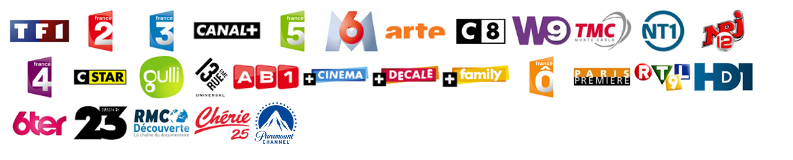

# Work in progress
Objective is for my blind father to be able to get the french TV program read by a Text to Speech (TTS) engine when pressing on a button

This java program will run on a raspberry pi 2/3

